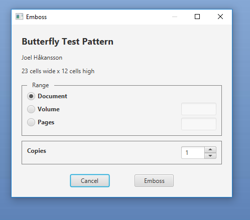

# Dotify Studio User Guide #
Dotify Studio provides an accessible graphical user interface for creating, managing and embossing PEF-files.

## Installing and running ##

### On Windows ###
If you are on a Windows system, download the Windows installer from the [latest releases](https://github.com/brailleapps/dotify-studio/releases) and follow the instructions. When the installer has completed, you can start the software via the start menu or by double clicking on a PEF-file.

Note: If you install other software that opens files ending with .pef (such as Adobe Photoshop or Adobe Creative Suite) after Dotify Studio, 
you may have to reinstall Dotify Studio to restore the .pef file association to Dotify Studio.

### On macOS ###
Download the macOS package from the [latest releases](https://github.com/brailleapps/dotify-studio/releases) and open it. Drag and drop the application to the applications folder. Start the software by launching the application.

### Linux ###
Download the zip-file from the [latest releases](https://github.com/brailleapps/dotify-studio/releases) and unzip the application. If you do not have Oracle Java installed on your machine, you have to download and install that as well. Once java is installed, you should be able to run the software with the script `bin/dotify-studio`.

## Preferences ##
Before you can emboss PEF-files, you must complete the setup. The menu item `Preferences` opens a dialog with tabs.

### General ###
The `General` tab contains a couple of basic settings, such as the target locale used when converting source documents into PEF and the preview font used when viewing a PEF-file. 

### Emboss ###
The `Emboss` tab contains settings related to embossing. 
 1. First select your **Device**. 
 1. Next you need to select the **Embosser** make and model. It might be apparent to you given the device name, but the application cannot interpret this information. It is very important that you select the correct embosser make and model, otherwise the application will not be able to correctly emboss your documents.

Additional options will be presented when embosser has been selected. Once all required options has been set, you will be able to emboss documents.

_Screenshot of Setup view._

### Manage paper ###
The `Manage paper` tab is used to define and manage custom paper formats.

## Embossing ##
Click the **Emboss** link in the preview window to emboss. Review the document information to verify that you are embossing the correct document.

To emboss a range of pages, a single volume or multiple copies, click **Show options**. Note that if this view is left for any reason, changes to the additional settings will be lost.

To emboss, click **Emboss now**.

_Screenshot of Emboss view._

To see more information about the book, select **About the book** in the preview window.

## Open files ##
To open files, select the **Open...** menu option in the **File** menu. 

## Search for files ##
If you keep all your PEF-files below a common folder, they can be found using the metadata supplied with the PEF-files.
For example by entering the title of a document.

To do this, open the `search` tab in the tools area, select the **Show search** menu option in the **Window** menu. By default
the "user home folder" is scanned, but it can be changed by clicking the `Select folder` button.